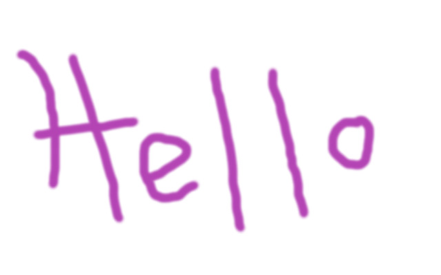

# Sample

This is a test file:

 (alive)
 (dead)

<!-- markdown-link-check-disable -->

 (dead)

<!-- markdown-link-check-enable -->
<!-- markdown-link-check-disable-next-line -->

 (dead)
 (dead) <!-- markdown-link-check-disable-line -->

<!-- markdown-link-check-disable -->

 (dead)

The <a href="https://www.w3.org/TR/wai-aria/#aria-label">aria-label</a> attribute is used to define a string that labels the current element.

It accepts a valid <LinkTo kind='components-label--defaultlabel'>Label</LinkTo> component.

-   Default:- `-`
